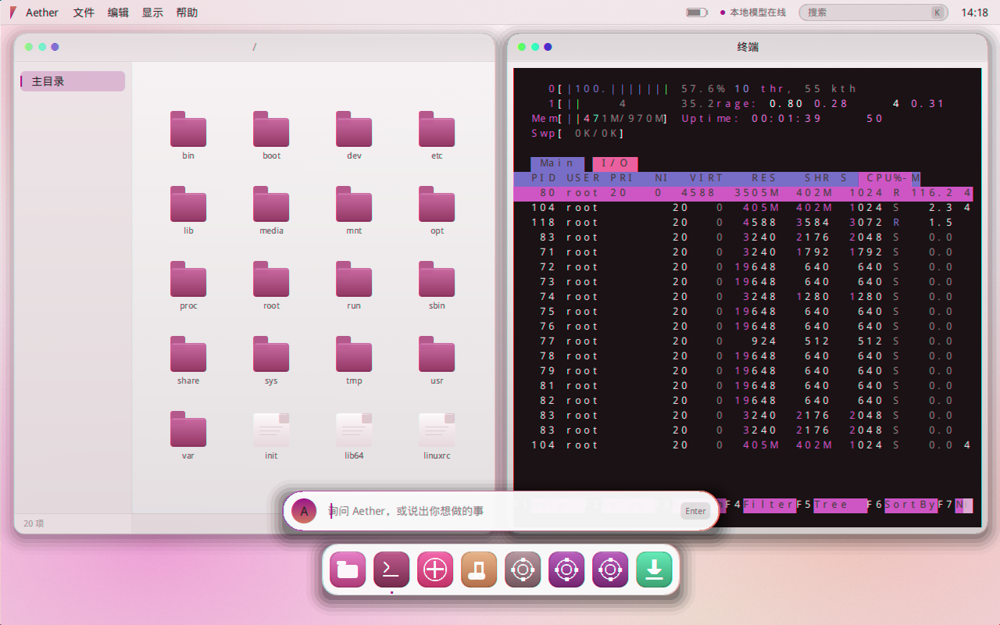
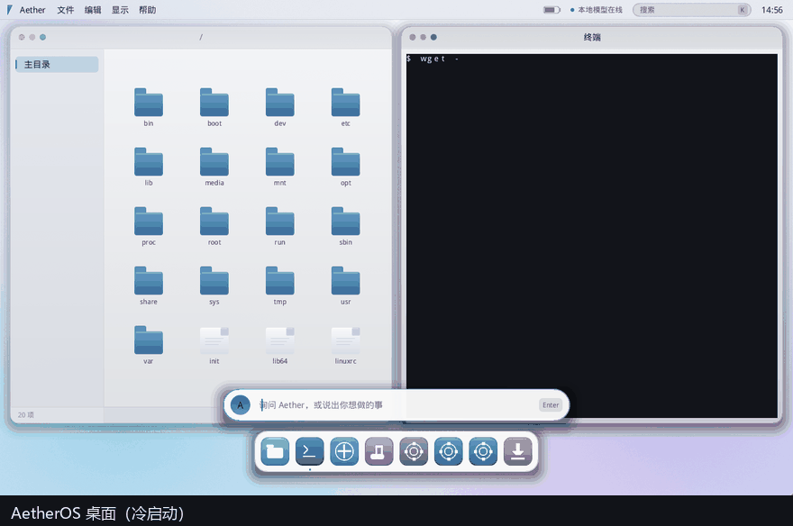
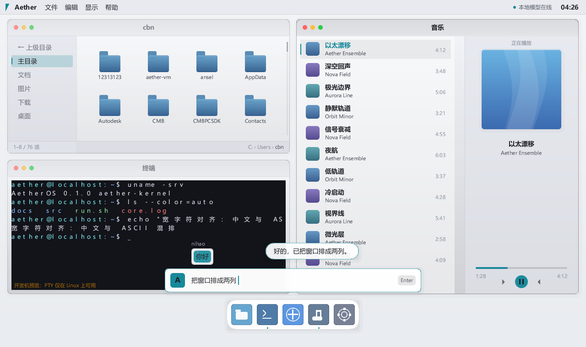
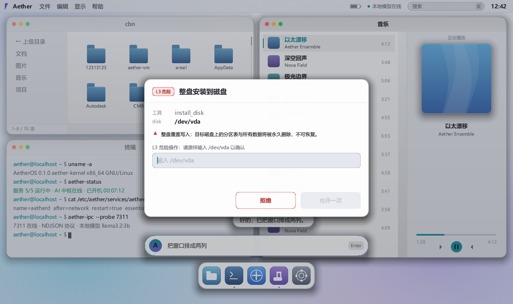

[中文](README.md) | **English** · [**Download ISO (38.5 MB)**](https://github.com/qwert702/AetherOS/releases/latest) · [Landing page](https://qwert702.github.io/AetherOS/) · [App packaging guide](docs/APP-PACKAGES.md)

# AetherOS





*The clip above is a real screen capture (frames grabbed straight from QEMU, nothing edited):
one line in the terminal — `wget -O- http://10.0.2.2/i|sh` — pulls a package from the host,
`aetherd` installs htop, and typing `htop` runs it on the desktop.*

**A desktop operating system whose entire user space is written from scratch in Rust on top of the Linux kernel — no X11 or Wayland client stack, no off-the-shelf desktop toolkit.** That screenshot is not a mockup: it is htop 3.3.0, taken straight out of the Ubuntu 24.04 archive, running on an AetherOS desktop.

The kernel is deliberately the one piece that is *not* rewritten — Android and ChromeOS use Linux too, and rewriting it buys nothing. All the engineering effort goes above it: **from PID 1 to the window compositor, the terminal, the Chinese input method and the AI hub, there is not a single off-the-shelf desktop component in the tree.**

| | |
|---|---|
| **Scale** | 22,661 lines of Rust / 41 source files / 7 crates (measured 2026-09-29) |
| **Verification** | 350 unit tests green · 0 compiler warnings on both targets · 12 h 43 m of continuous uptime without a crash · permission chain proven end to end |
| **Artifact** | bootable ISO ≈ 38.5 MB, tested booting in QEMU, VirtualBox and VMware |

## What makes it unusual

- **The whole user space is home-grown.** The compositor rasterizes in software over `fbdev` and needs no GPU; the VT/ANSI parser, the PTY glue layer, the Chinese input method, PID 1, the IPC protocol and the disk installer are all first-party code. None of the seven crates is glued together from an existing desktop stack.
- **The AI is a first-class part of the system, not a chat window.** `aetherd` runs as a daemon and exposes 15 tools that actually operate the machine. Simple commands are answered by an offline rule-based intent channel (**no model call at all**); only complex requests reach an LLM, which is routed locally or to the cloud according to privacy and complexity.
- **The permission model is the most carefully designed part of the system.** Four authorization levels (L0–L3), one-time confirmation tokens bound to both the tool and its arguments (5-minute expiry, single use), six distinct audit verdicts, and a rejection cooldown. The key invariant is **sensitive output is pinned local**: once `read_file` or `clipboard_read` results enter the context, every later round of that conversation stays on-device and never goes to the cloud. This was not inferred — the exfiltration path was demonstrated end to end with **two fake LLM endpoints and a canary file** (a 13-character input and two file reads, with the canary indeed arriving at the cloud endpoint), and the fixed behavior is pinned by two `router` unit tests.
- **Verifiable, not "looks fine to me".** Beyond the 350 unit tests there is a **per-pixel regression gate over 10 archived walkthrough images** (fails on more than 0.02% difference), a 12 h 43 m stability soak (3,053 patrol rounds: 0 service exits, 0 restarts, 0 panics, no memory leak trend), and four full code-review rounds with **zero unresolved findings**.
- **It really installs applications.** On a system with no package manager at all, it ships its own application package format (manifest + dependency preflight). Installed programs are immediately callable from `/usr/local/bin`, **an icon appears in the Dock**, and clicking it opens a terminal and runs the program.

## Quick start

No build machine at hand? Grab the prebuilt bootable ISO from the [latest release](https://github.com/qwert702/AetherOS/releases/latest) — it boots in QEMU, VirtualBox and VMware.

You do not need a virtual machine to preview the desktop:

```bash
git clone https://github.com/qwert702/AetherOS.git
cd AetherOS

cargo run -p aether-compositor                     # interactive preview (light theme by default)
cargo run -p aether-compositor -- --theme dark     # deep-space theme
cargo run -p aether-compositor -- --shot 2         # single-frame screenshot self-check
cargo test --workspace                             # unit tests (334 on Windows, see "Testing and verification")
```

Building the bootable ISO requires a Linux build host running Buildroot — see `platform/README.md`.
On a Windows development machine, add `--offline` to `cargo`, otherwise it stalls on registry access.

## What it does today

- **Desktop** — four layouts (float / two-column / three-column / monocle), drag-to-edge snapping, window resizing, light and dark themes. Steady-state frame time was optimized from 91 ms down to **15.5 ms**.
- **Terminal** — a real PTY, with a home-grown VT/ANSI parser (29 unit tests; pure logic, so it is testable on any platform).
- **Chinese input** — a first-party input method with a ~100-entry dictionary (negligible size, no licensing burden), toggled with `Ctrl+Space`, and wired into both the AI command bar and the terminal.
- **AI hub** — `aetherd` runs resident: intent → routing → tools (up to 4 rounds) → permission gate → audit.
- **System** — `aether-init` runs as PID 1 with a service whitelist, topological ordering, exponential-backoff restarts and zombie reaping; a persistent partition; and a whole-disk installer.
- **AI operations** — `aether-ops` patrols every 15 seconds, restarts unhealthy services, and writes a diagnosis report to disk.



## Application packages

There is no package manager (no opkg, apk, apt or rpm) and no software repository, but there is an installation mechanism of its own. An application package is just a directory: an `app.json` manifest plus the executable, with an optional `lib/` for bundled shared libraries.

```sh
aetherd app install /tmp/hello    # install (runs dependency preflight first)
aetherd app list                  # list what is installed
aetherd app remove hello          # uninstall (moves to the recycle bin, never deletes outright)
```

After installation a wrapper script is generated in `/usr/local/bin`, so the program is callable by name from any terminal; **an icon also appears in the Dock** (teal, after the five built-in icons), and clicking it opens a terminal window and runs the program. The AI can install applications too: "install this" produces an L2 confirmation card and then goes through exactly the same code path.

**Preflight runs before anything is copied**, because installing something that cannot start is worse than failing to install it:

| Case | Result |
|---|---|
| Statically linked (`gcc -static`, Rust musl static, default Go) | always runs |
| Dynamically linked, dependencies present in the image | runs |
| Dynamically linked, dependencies missing | `error while loading shared libraries`; preflight lists exactly which ones |

The image ships glibc 2.38 with backward compatibility, so a glibc version mismatch is rarely the problem; a missing `.so` is. The package format, manifest fields and limits are documented in [`docs/APP-PACKAGES.md`](docs/APP-PACKAGES.md).

The system partition is read-only (ISO9660 plus an initramfs loaded entirely into memory). Only the ext4 partition mounted at `/var` is writable and survives a reboot.

**Is this Linux software?** Yes. The kernel is Linux and the user space is x86-64 glibc, so what runs here is an ordinary Linux ELF binary.

## Running software from the wild

**It installs real-world Linux programs — just not with `apt install`.** Measured results (2026-09-29):

| Kind of program | Result |
|---|---|
| Statically linked (Go, Rust **musl**, `gcc -static`) | ✅ runs as-is |
| Dynamically linked, libraries already in the image | ✅ runs (the image now ships ncurses + terminfo, zlib, openssl, libffi, expat) |
| Dynamically linked, needing something else (libnl, libstdc++, …) | ✅ **just bring it along** — `scripts/mkapp.py` collects the missing libraries into the package automatically |

Going from a program on the host to running it inside the guest takes three steps:

```bash
# (1) host: package it (collects missing libraries and terminfo, verifies glibc symbol versions)
python3 scripts/mkapp.py /usr/bin/htop --id htop --image-lib-dir <image rootfs> --out dist/apps --tar
# (2) host: serve the package (in QEMU user-mode networking the guest reaches the host at 10.0.2.2)
python3 scripts/serve-apps.py --dir dist/apps
```

```sh
# (3) guest: pull it down, install it, run it
wget http://10.0.2.2:8765/htop.aep -O /var/tmp/htop.aep
mkdir -p /var/tmp/pkg && tar xf /var/tmp/htop.aep -C /var/tmp/pkg
aetherd app install /var/tmp/pkg/htop
htop
```

**The proof: htop 3.3.0 (the official Ubuntu 24.04 package) installs into AetherOS and runs.** The packager skips the glibc family, notices that the image's `libncursesw` is missing the `NCURSESW6_*` version symbols and therefore ships the host copy instead, and bundles two libnl libraries plus libtinfo — about 1 MB in total. Once installed, typing `htop` in the terminal is all it takes.

> The screenshot at the top of this page is a real capture: a QEMU-hosted AetherOS desktop where the package was fetched with `wget`, installed with `aetherd app install`, and launched as `htop` — full TUI, CPU meters, memory, process table and the F1–F10 key bar.

Details, rules and boundaries are in [`docs/APP-PACKAGES.md`](docs/APP-PACKAGES.md).

## Architecture

```
┌────────────────────────────────────────────────┐
│  aether-compositor + aether-shell (placeholder)│  desktop / top bar / Dock / AI command bar
│    draw · layout · text · term(vt/pty)         │
│    ime · textview · input · wayland(spike)     │
├────────────────────────────────────────────────┤
│  aetherd          AI hub: intent → route → tool│  permission gate L0–L3 · audit
│  aether-ops       AI ops: patrol → diagnose    │
├────────────────────────────────────────────────┤
│  aether-ipc       unified IPC (JSON / NDJSON)  │
├────────────────────────────────────────────────┤
│  aether-init      PID 1 / service management   │  musl static
│  aether-install   whole-disk installer         │
├────────────────────────────────────────────────┤
│  glibc · driver stack · firmware               │  mature open source
├────────────────────────────────────────────────┤
│  Linux kernel                                  │
└────────────────────────────────────────────────┘
```

Key paths through the system:

```
UI ──RegisterUi──▶ aetherd:7311 ──▶ UiRegistered    (prerequisite for clipboard / config hot reload)
UI ──Chat────────▶ fast intent → router → llm → tools (up to 4 rounds)
                    perm gate (L0-L3) → aether-audit.log
   ◀──ChatChunk(channel) / Action / NeedsConfirmation(token)

aether-init:7312 / unix socket 0600 ◀─ ServiceControl ─ start/stop and supervision
aether-ops patrol ─▶ init service status + /var/log/aether ─▶ self-healing restart
```

## Components

| Directory | Lines | Description | Milestone |
|---|---|---|---|
| `aether-compositor/` | 12,845 | Compositor plus desktop shell responsibilities (rendering / layout / terminal / IME / Wayland spike) | M1–M2 |
| `aetherd/` | 5,565 | AI hub daemon (agent / tools / permissions / routing / model config / recycle bin / app installation) | M4 |
| `aether-init/` | 1,319 | PID 1 and service management | M3 |
| `aether-ops/` | 736 | AI operations and self-healing | M5 |
| `aether-install/` | 505 | Disk installer | M6 |
| `aether-ipc/` | 334 | System-wide IPC protocol | M0 |
| `aether-shell/` | 11 | Placeholder skeleton | M2 |
| `platform/` | — | Buildroot external tree, rootfs overlay, ISO packaging | M3 |
| `scripts/` | — | Host-side development, walkthrough images, end-to-end verification | ongoing |
| `docs/` | — | Architecture, protocols, permission model, roadmap, review reports | ongoing |

> Line counts drift with every commit, so do not copy them by hand: run `python scripts/repo-stats.py` for the authoritative numbers (same source as the per-file table in `INDEX.md`; `--check` turns it into a gate).

## Permission model

The AI can operate a real machine, so permissions are where most of the design effort went. The full design is in [`docs/ai-permissions.md`](docs/ai-permissions.md).

| Level | Behavior | Tools |
|---|---|---|
| L0 | no confirmation | `sys_info`, `read_file`, `sys_probe`, `trash_list`, `app_list` |
| L1 | no confirmation | `desktop`, `clipboard_read`, `clipboard_write` |
| L2 | confirmation card | `file_write`, `file_delete`, `file_rename`, `trash_restore`, `app_install`, `app_remove` |
| L3 | confirmation plus echo of the target | `install_disk` |

A few invariants hold this together:

- **The write whitelist is strictly narrower than the read whitelist.** The AI may read `/etc/aether` and `/var/log/aether` but never write them — writing the former would let it rewrite its own permission rules, writing the latter would let it tamper with the audit trail. A test enforces this.
- **Dangerous operations never get their own IPC variant**; they all go through `ToolCall` and the gate. The clipboard once bypassed the entire gate through a `Request` variant; that lesson is now a regression test (`request_variants_are_gated`).
- **Confirmation tokens bind the tool and its arguments**, expire after 5 minutes, and are single-use. Only a registered UI channel can redeem one; unregistered connections get a 403 and a `rejected_no_ui` audit entry.
- **The audit log distinguishes six verdicts** (`allowed` / `failed` / `needs_confirmation` / `denied` / `denied_by_user` / `rejected_no_ui`), rotates past 8 MB, and raises an explicit warning if a write fails instead of dropping the record silently.
- **`read_file` and `clipboard_read` are marked as sensitive output**, and their results force local inference — they never reach the cloud.



## Testing and verification

| Method | Status |
|---|---|
| Unit tests | 334 green on Windows (measured 2026-09-29); the Linux build also compiles and runs the Linux-only test targets, so its total is higher |
| Compiler warnings | 0 on both targets |
| Visual regression | 10 archived walkthrough images compared pixel by pixel, currently 10/10 with zero difference |
| Code review | Four full and incremental review rounds, every finding fixed (zero unresolved); the consolidated report is [`docs/archive/CODE-REVIEW-2026-09.md`](docs/archive/CODE-REVIEW-2026-09.md) |
| End-to-end | Permission chain, installer, QEMU QMP keyboard/mouse injection plus screenshots |
| In-VM self-healing | Killing the compositor inside QEMU makes init restart it and reinitialize display, fonts and input |
| Stability soak | 12 h 43 m of continuous uptime in QEMU: 3,053 patrol rounds, 0 service exits, 0 automatic restarts, 0 panics, stable memory (raw log `docs/evidence/soak-2026-09-28-12h43m.log.gz`) |
| Application installation | Verified on a live image: a static program installed under `/var/apps` runs from the guest terminal by name and shows up in the Dock |

After changing anything under `cfg(target_os = "linux")`, you must also build for `--target x86_64-unknown-linux-musl` or test on a Linux machine — a Windows build excludes those code paths entirely, so errors and warnings in them are invisible on the development host.

## Documentation

| Document | Contents |
|---|---|
| [`INDEX.md`](INDEX.md) | Code index: components and entry points, per-file responsibilities, tool list, test distribution, keybindings, common commands |
| [`docs/roadmap.md`](docs/roadmap.md) | Milestones M0–M6 and known engineering gaps |
| [`docs/PRODUCTION-PLAN-2026-09-28.md`](docs/PRODUCTION-PLAN-2026-09-28.md) | Production-readiness checklist and its six hard gates (**6/6 met**) |
| [`docs/ui-design-handover.md`](docs/ui-design-handover.md) | Authoritative visual design reference: design tokens, dual-mode themes, environment pitfalls |
| [`docs/APP-PACKAGES.md`](docs/APP-PACKAGES.md) | Application package format: how to build one, how to install it, how to read preflight, where the limits are |
| [`docs/ai-permissions.md`](docs/ai-permissions.md) | The AI permission model |
| [`docs/WRITE-OPS-2026-09-28.md`](docs/WRITE-OPS-2026-09-28.md) | Constraints on writable file operations |
| [`docs/PHASE3-DECISION-2026-09-28.md`](docs/PHASE3-DECISION-2026-09-28.md) | Decision framework and exit criteria for Wayland |
| [`ARCHITECTURE.md`](ARCHITECTURE.md) | Layering and ADRs (frozen at M0; see INDEX for current state) |
| [`docs/HANDOVER.md`](docs/HANDOVER.md) | Handover report: measured results plus build and verification manual |
| [`docs/archive/`](docs/archive/) | Historical snapshots (decision history, not a statement of current state) |

## License

**GPL-3.0-only** — full text in [LICENSE](LICENSE).

You are free to use, modify and redistribute it. If you **distribute** a derivative work (as a binary or by offering it as a network service), you must release the complete corresponding source under GPL-3.0 as well, with no additional restrictions.

The ISO is an aggregate containing independent programs under various licenses:

| Component | License |
|---|---|
| Linux kernel | GPL-2.0-only |
| BusyBox | GPL-2.0 |
| First-party user space (the seven `aether-*` crates) | GPL-3.0-only |
| Rust dependencies (anyhow / log / serde / libc / fontdue / minifb and others) | MIT or MIT + Apache-2.0 |

User-space programs use kernel services through normal system calls and, under the exemption in the kernel's `COPYING` (*"This copyright does not cover user programs that use kernel services by normal system calls"*), are not derivative works — so the first-party code can choose GPL-3.0 on its own terms.

GPL-2.0 and GPL-3.0 are mutually incompatible. The current architecture is unaffected, but any kernel module added later would have to be GPL-2.0 compatible.

---

Repository: **https://github.com/qwert702/AetherOS**

A note on scope for developers: AetherOS is not trying to replace your daily desktop yet, and some things are deliberately out of scope rather than pending — for example, no X11/Wayland client stack and no interpreter runtime, to keep the image small. The Linux kernel is used as-is; everything above it is the project.
