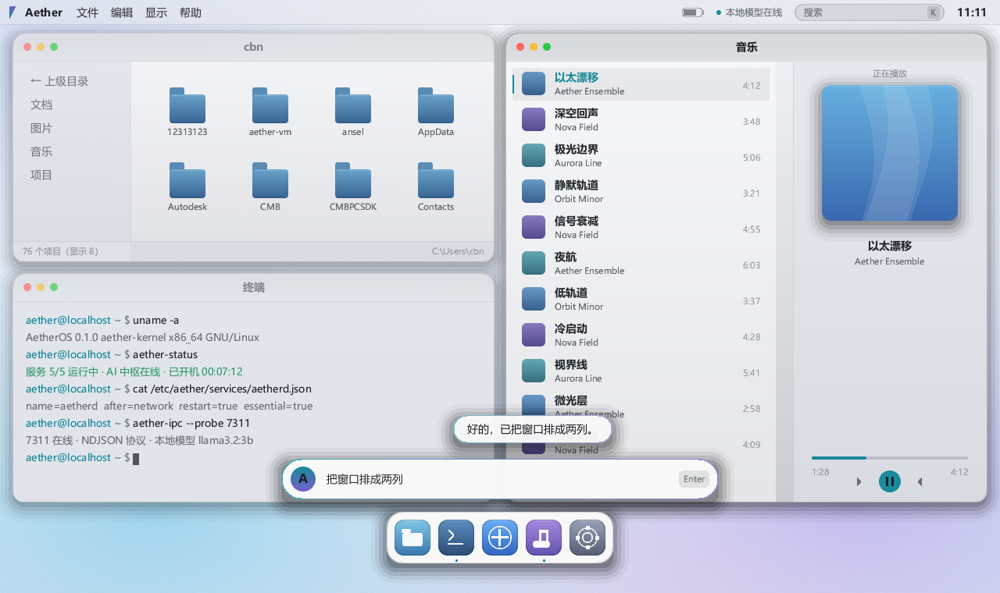

# AetherOS

一个自研操作系统：Linux 内核 + 自己写的 Rust 用户态 + AI 中枢。

内核不重写。Android、ChromeOS 都用 Linux 内核，重写它没有差异化价值。力气放在内核之上的每一层：
PID 1、窗口合成器、终端、中文输入、AI 中枢、AI 运维、安装器 —— 用户态没有一行现成的桌面组件。



## 现在是什么状态

能开机、能跑、大部分功能能用，但还不能当日常系统。

**已经跑通的：**

- **桌面**：自研合成器，fbdev 软件光栅化，不依赖 GPU。四种布局（自由/两列/三列/独占）、
  拖边吸附、窗口缩放、明暗双主题。稳态帧耗时从 91 ms 优化到 15.5 ms
- **终端**：真 PTY，VT/ANSI 解析器是自己写的，30 项单测，跨平台可测
- **中文输入**：自研输入法，自建词表约 100 条，`Ctrl+Space` 切换，指令条和终端都已接
- **AI 中枢**：`aetherd` 常驻。系统指令走离线规则通道（不调模型），复杂请求才进 LLM；
  本地/云端按隐私和复杂度混合路由；12 个工具；L0–L3 分级授权
- **系统**：`aether-init` 作 PID 1，服务白名单 + 拓扑排序 + 指数退避重启 + 僵尸收割；
  持久化分区；整盘安装器
- **AI 运维**：`aether-ops` 每 15 秒巡检，异常服务自动重启，故障诊断报告落盘
- **产物**：可引导 ISO，约 30 MB，QEMU / VirtualBox / VMware 都实测开机过


**没做或不完整的：**

- 还不是日常可用的系统。现在是"每个子系统都真跑通了"的阶段，不是"能替代你桌面"的阶段
- 没有 GPU 加速，全部软件光栅化。这是刻意的取舍，代价是大面积重绘的余量有限
- 不支持 Wayland 客户端。桌面走 `DRM → fbdev`。9 月 28 日起有一个自研 `wl_display` 子集的
  spike，线协议、对象表、`wl_shm` 像素读取、surface 接进渲染管线都做完了，但没接进生产路径
- AI 没接过真实模型。协议层用双假端点验证过（21 项断言），真模型待接
- **没有做过实机按键验证**：文件管理器的 `Delete` 删除、终端拖选复制、终端内的中文输入
  都只到编译与源码确认为止（`Delete` 走的 L2 确认链路在代码上是完整的）
- **没有物理机验证**：所有验证都在虚拟机内完成（QEMU / VirtualBox / VMware）。稳定性已经连续
  跑过 **12 小时 43 分不崩**（3053 轮巡检零退出、零重启、零 panic，原始日志在 `docs/evidence/`），
  但那是虚拟硬件；真机、真显卡、真外设都还没碰过
- `aether-shell` 是 11 行的占位，Shell 职责暂时压在 compositor 里

## 装应用

没有包管理器（opkg / apk / apt / rpm 都没有），也没有软件仓库，但有一套自己的安装机制。
一个"应用包"就是一个目录：`app.json` 清单 + 可执行文件，可选 `lib/` 放自带的共享库。

```sh
aetherd app install /tmp/hello    # 装（先做依赖预检）
aetherd app list                  # 列出已装
aetherd app remove hello          # 卸载（进回收站，不是直接删）
```

装完 `/usr/local/bin` 里会生成一个包装脚本，终端直接敲 `hello` 就能跑；
**Dock 里也会多出一个图标**（青绿色，排在五个内建图标之后），点一下就开个终端窗口把它跑起来。
也可以让 AI 装：「把这个装上」→ 弹 L2 确认卡片 → 走同一套逻辑。

**装之前会做预检**，因为装完跑不起来比装不上更糟。实测结论：

| 情况 | 结果 |
|---|---|
| 静态链接（`gcc -static` / Rust musl 静态 / Go 默认） | 一定能跑 |
| 动态链接，依赖的库都在镜像里 | 能跑 |
| 动态链接，缺依赖库 | 报 `error while loading shared libraries`，预检会列出缺哪几个 |

镜像里的 glibc 是 2.38 且向后兼容，所以"glibc 版本对不上"通常不是问题；真正会挂的是缺 `.so`
—— 镜像里只有 glibc、libgcc 等少数几个库。**最省事就是静态链接。**

写一个包、清单字段、边界，见 [`docs/APP-PACKAGES.md`](docs/APP-PACKAGES.md)。

系统区是只读的（ISO9660 + initramfs 全在内存），只有 `/var` 那个 ext4 分区可写、重启保留。

**是 Linux 软件吗**：是。内核是 Linux，用户态是 glibc 的 x86-64，能跑的就是 Linux 的 ELF 二进制。

## 架构

```
┌───────────────────────────────────────────────┐
│  aether-compositor + (占位) aether-shell       │  桌面 / 顶栏 / Dock / AI 指令条
│    draw · layout · text · term(vt/pty)         │
│    ime · textview · input · wayland(spike)     │
├───────────────────────────────────────────────┤
│  aetherd          AI 中枢：意图 → 路由 → 工具  │  权限闸门 L0–L3 · 审计
│  aether-ops       AI 运维：巡检 → 诊断 → 自愈  │
├───────────────────────────────────────────────┤
│  aether-ipc       统一 IPC（JSON / NDJSON）    │
├───────────────────────────────────────────────┤
│  aether-init      PID 1 / 服务管理 / 持久化    │  musl 静态
│  aether-install   整盘安装器                   │
├───────────────────────────────────────────────┤
│  glibc · 驱动栈 · 固件                         │  成熟开源件
├───────────────────────────────────────────────┤
│  Linux kernel                                  │
└───────────────────────────────────────────────┘
```

关键链路：

```
UI ──RegisterUi──▶ aetherd:7311 ──▶ UiRegistered    （剪贴板 / 配置热载的前置门槛）
UI ──Chat────────▶ intent 快速意图 → router 路由 → llm → tools（最多 4 轮）
                    perm 闸门(L0-L3) → aether-audit.log
   ◀──ChatChunk(channel) / Action / NeedsConfirmation(token)

aether-init:7312 / unix socket 0600 ◀─ ServiceControl ─ 服务启停与监督
aether-ops 巡检 ─▶ init 服务状态 + /var/log/aether ─▶ 自愈重启
```

## 组件

| 目录 | 行数 | 说明 | 里程碑 |
|---|---|---|---|
| `aether-compositor/` | 12,720 | 合成器 + 桌面 Shell 职责（渲染 / 布局 / 终端 / IME / Wayland spike） | M1–M2 |
| `aetherd/` | 3,945 | AI 中枢守护进程（agent / 工具 / 权限 / 路由 / 模型配置 / 回收站） | M4 |
| `aether-init/` | 1,305 | PID 1 与服务管理 | M3 |
| `aether-ops/` | 736 | AI 运维与自修复 | M5 |
| `aether-install/` | 505 | 磁盘安装器 | M6 |
| `aether-ipc/` | 334 | 全系统 IPC 协议 | M0 |
| `aether-shell/` | 11 | 占位骨架 | M2 |
| `platform/` | — | Buildroot 外部树、rootfs overlay、ISO 打包 | M3 |
| `scripts/` | — | 宿主开发、走查图、端到端验证脚本 | 持续 |
| `docs/` | — | 架构、协议、权限模型、路线图、审查报告 | 持续 |

合计 19,556 行 Rust / 40 个源文件 / 7 个 crate（2026-09-28 实测）。

## 快速开始

不需要虚拟机就能预览桌面：

```bash
git clone https://github.com/qwert702/AetherOS.git
cd AetherOS

cargo run -p aether-compositor                     # 交互预览（默认明亮主题）
cargo run -p aether-compositor -- --theme dark     # 深空主题
cargo run -p aether-compositor -- --shot 2         # 单帧截图自检
cargo test --workspace                             # 单元测试（Windows 302 项）
```

构建可引导 ISO 需要一台 Linux 构建机（Buildroot），见 `platform/README.md`。
在 Windows 开发机上 `cargo` 要加 `--offline`，否则会卡在 registry 访问。

## 权限模型

AI 能操作真实的机器，所以权限这块是系统里设计得最细的部分。
完整设计见 [`docs/ai-permissions.md`](docs/ai-permissions.md)。

| 等级 | 行为 | 工具 |
|---|---|---|
| L0 | 免确认 | `sys_info`、`read_file`、`sys_probe`、`trash_list` |
| L1 | 免确认 | `desktop`、`clipboard_read`、`clipboard_write` |
| L2 | 弹确认卡片 | `file_write`、`file_delete`、`file_rename`、`trash_restore` |
| L3 | 确认 + 回显目标 | `install_disk` |

几条不变量：

- 写白名单比读白名单窄。AI 可以读 `/etc/aether` 和 `/var/log/aether`，但不能写 ——
  写前者等于让它改自己的权限规则，写后者等于篡改审计记录。有测试守着这条
- 危险操作不新增 IPC 变体，一律走 `ToolCall` 过闸门。历史上剪贴板曾经走 `Request` 变体
  绕过了整套闸门，这个教训现在是一条回归测试
- 确认令牌绑定工具和参数，5 分钟过期，用后即废；每次裁决都写审计日志
- `read_file` 和 `clipboard_read` 标记为敏感输出，其结果强制本地推理、不上云


## 测试与验证

| 手段 | 现状 |
|---|---|
| 单元测试 | Windows 318 / Linux 328，均全绿 |
| 编译警告 | 两个目标都是 0 条 |
| 视觉回归 | 10 张归档走查图逐像素比对，当前 10/10 零差异 |
| 代码审查 | 四轮全量 / 增量审查 + 修复报告 |
| 端到端 | 权限链路、安装器、QEMU QMP 键鼠注入 + 截图 |
| 实机自愈 | QEMU 内 kill 掉合成器 → init 自动拉起并重新初始化显示/字体/输入 |
| 稳定性长跑 | 连续 **12 小时 43 分**不崩：3053 轮巡检，服务退出 0 / 自动重启 0 / panic 0，内存稳定无泄漏（原始日志 `docs/evidence/soak-2026-09-28-12h43m.log.gz`） |
| 应用安装 | 实机验证：装进 `/var/apps` 的静态程序在 guest 终端里直接敲名字即可运行，并出现在 Dock 里 |

改 `cfg(target_os = "linux")` 的代码之后必须跑 `--target x86_64-unknown-linux-musl`
或到 Linux 机器上测。Windows 构建会整段屏蔽那些路径，编译错误和警告在开发机上一点都看不到。

## 文档

| 文档 | 内容 |
|---|---|
| [`INDEX.md`](INDEX.md) | 代码索引：组件与入口、逐文件职责、工具清单、测试分布、键盘、常用命令 |
| [`docs/roadmap.md`](docs/roadmap.md) | 里程碑 M0–M6，以及已知的工程质量缺口 |
| [`docs/PRODUCTION-PLAN-2026-09-28.md`](docs/PRODUCTION-PLAN-2026-09-28.md) | 生产力化清单与六个硬门禁（**6/6 全部达成**） |
| [`docs/ui-design-handover.md`](docs/ui-design-handover.md) | 视觉设计的权威依据：设计令牌、双模主题、环境陷阱 |
| [`docs/APP-PACKAGES.md`](docs/APP-PACKAGES.md) | 应用包格式：怎么做、怎么装、预检怎么读、边界在哪 |
| [`docs/ai-permissions.md`](docs/ai-permissions.md) | AI 权限模型 |
| [`docs/WRITE-OPS-2026-09-28.md`](docs/WRITE-OPS-2026-09-28.md) | 可写文件操作的约束 |
| [`docs/PHASE3-DECISION-2026-09-28.md`](docs/PHASE3-DECISION-2026-09-28.md) | Wayland 的决策框架与放弃条件 |
| [`ARCHITECTURE.md`](ARCHITECTURE.md) | 分层与 ADR（M0 冻结稿，看现状请用 INDEX） |
| [`docs/HANDOVER.md`](docs/HANDOVER.md) | 交接报告：实测记录 + 构建/验证手册 |

## 许可证

**GPL-3.0-only**，全文见 [LICENSE](LICENSE)。

可以自由使用、修改、分发。但**分发**衍生作品（发二进制或通过网络提供服务）时，
必须同样以 GPL-3.0 开源完整对应源码，且不得附加额外限制。

ISO 是聚合体，里面打包了许可证各异的独立程序：

| 组件 | 许可证 |
|---|---|
| Linux 内核 | GPL-2.0-only |
| BusyBox | GPL-2.0 |
| 自研用户态（`aether-*` 七个 crate） | GPL-3.0-only |
| Rust 依赖（anyhow / log / serde / libc / fontdue / minifb 等） | MIT 或 MIT + Apache-2.0 |

用户态程序通过系统调用使用内核服务，按内核 `COPYING` 的豁免条款
（*"This copyright does not cover user programs that use kernel services by normal system calls"*）
不构成衍生作品，所以自研部分可以独立选 GPL-3.0。

GPL-2.0 与 GPL-3.0 互不兼容。当前架构不受影响，但将来若新增内核模块，那部分必须是 GPL-2.0 兼容的。
